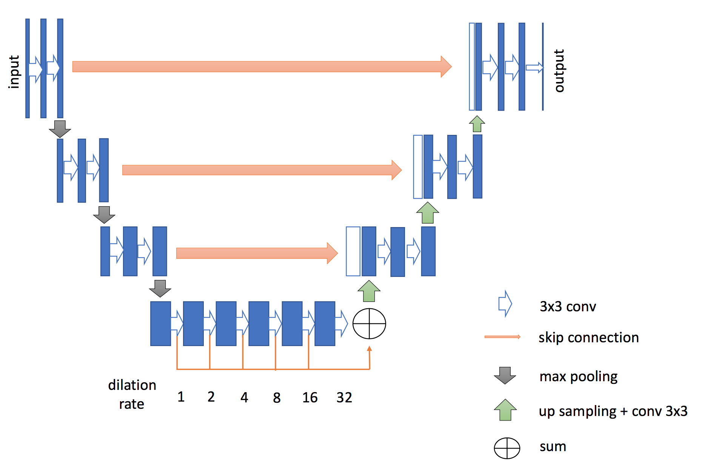

# COMP540 Road Segmentation Project

The final task of the COMP540 (Statistical Machine Learning) class was to build a model that could accurately segment roads within a set of Google Earth images. We were given approximately 11,000 images with corresponding hand-drawn masks to act as a training set, along with a validation set containing ~2,000 unlabeled images. Student groups were scored (by the Dice coefficient metric) and ranked according to the accuracy of predictions on this validation set.

This repository serves as a record of our group's work, where we utilized a convolutional neural network architecture (called a Dilated U-Net) to achieve a final Dice coefficient score of 0.73273.

## Dilated U-Net Architecture

Our final model was a blending of two parts:
- A simple U-Net architecture, comprised of successive encoder blocks, corresponding decoder blocks, and a bottleneck in between.
- A series of dilated convolutional layers, which were then summed together and passed into the decoding blocks.



## Usage

### Prerequisites

- Keras 2.2.4
- scikit-image
- imgaug

### Installing

To create a conda environment, use the given YAML file
```bash
git clone https://github.com/drshapir/road-segmentation
conda env create -f environment.yml
```

### Data preparation

The model requires a directory with both Google Earth satellite images (256x256) and mask images the provide pixel-by-pixel
labels of roads. Training and testing datasets should be in separate directories.

### Training and prediction

To train the model using the default parameters (decided through experimentation), run the following command:
```python
python train.py
```

Model hyperparameters and training data path can be modified at the bottom of the training script.

To predict on another directory of images:
```python
python predict.py
```

#### Import functions

Although not built as a Python package, training and prediction code is modularized, so you can import it with an extra step:
```python
import sys
sys.path.append('/path/above/roadseg-repo/')
import RoadSegmentation
```

Model hyperparameters, filepath to model weights, and filepath to image data can be modified at the bottom of the prediction script.


## Contributors

[Yash Lagisetty](https://github.com/oppy2292)

## Citations

1. Ronneberger, O., Fischer, P., Brox, T.(2015). U-Net: Convolutional Networks for Biomedical ImageSegmentation.  In N. Navab, J. Hornegger, W. M. Wells, & A. F. Frangi (Eds.), Medical Image Computingand Computer-Assisted Intervention – MICCAI 2015 (pp.  234–241).  Cham:  Springer International Pub-lishing
2. Yu, F., and Koltun, V. (2015). Multi-Scale Context Aggregation by Dilated Convolutions.
3. Dilated U-Net github reference: https://github.com/lyakaap/Kaggle-Carvana-3rd-place-solution
